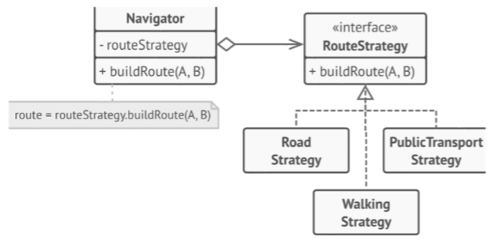

# Implementación del Patrón de Diseño Estrategia (Strategy) en Java

**Materia**: Ingenieria de software 3

**Nombre**: Miguel Perez Ojeda

**Caso de estudio:** Sistema de navegación para viajeros ocasionales.

## Descripción del Proyecto
Este proyecto consiste en la implementación práctica del **Patrón de Diseño Estrategia (Strategy)** utilizando el lenguaje Java. El objetivo es resolver el caso de estudio de un sistema de navegación para viajeros ocasionales, donde el usuario puede calcular una ruta utilizando diferentes métodos de transporte (Coche, Transporte Público o Caminando) y cambiar de método dinámicamente sin modificar el núcleo del sistema.

La implementación sigue fielmente el diagrama de clases UML proporcionado, compuesto por 1 interfaz, 3 clases concretas y 1 clase de contexto.



## Estructura del Proyecto
El código está organizado en paquetes para mantener una arquitectura limpia y cumplir con los principios SOLID (específicamente el Principio de Abierto/Cerrado).

```text
ProyectoNavegacion/
│
├── src/
│   ├── Main.java                          # Cliente (Prueba del sistema)
│   │
│   ├── contexto/
│   │   └── Navigator.java                 # Clase Contexto (1)
│   │
│   └── estrategias/
│       ├── RouteStrategy.java             # Interfaz Estrategia (1)
│       ├── RoadStrategy.java              # Estrategia Concreta (1)
│       ├── PublicTransportStrategy.java   # Estrategia Concreta (2)
│       └── WalkingStrategy.java           # Estrategia Concreta (3)
```

## ¿Cómo funciona?
El patrón Strategy permite definir una familia de algoritmos, encapsularlos y hacerlos intercambiables. En este proyecto se refleja de la siguiente manera:

1. **`RouteStrategy` (Interfaz):** Define el contrato común con el método `buildRoute(String pointA, String pointB)`. No sabe *cómo* se calcula la ruta, solo exige que se calcule.
2. **Estrategias Concretas (`RoadStrategy`, `PublicTransportStrategy`, `WalkingStrategy`):** Implementan la interfaz y contienen la lógica específica para calcular el tiempo y la ruta según el medio de transporte.
3. **`Navigator` (Contexto):** Es el intermediario. Mantiene una referencia privada a una `RouteStrategy` (Agregación). No calcula rutas por sí mismo; cuando se le pide una ruta, **delega la responsabilidad** a la estrategia que tenga inyectada en ese momento.
4. **`Main` (Cliente):** Crea el `Navigator`, le inyecta una estrategia inicial y luego utiliza el método `setRouteStrategy()` para cambiar el comportamiento del navegador en tiempo de ejecución.

## ¿Cómo ejecutar el proyecto?

### Requisitos previos
* Tener instalado el **JDK (Java Development Kit)** versión 8 o superior.
* Una terminal (CMD, PowerShell, Bash) o un IDE (IntelliJ IDEA, Eclipse, VS Code).

### Opción 1: Desde la Terminal (Línea de comandos)
Abre una terminal en la raíz del proyecto (`ProyectoNavegacion/`) y ejecuta los siguientes comandos:

1. **Compilar todos los archivos Java:**
   ```bash
   javac -d . src/estrategias/*.java src/contexto/*.java src/Main.java
   ```

2. **Ejecutar la clase principal:**
   ```bash
   java Main
   ```

### Opción 2: Desde un IDE (IntelliJ, Eclipse, VS Code)
1. Abre el proyecto en tu IDE preferido.
2. Asegúrate de que el SDK de Java esté configurado.
3. Busca el archivo `src/Main.java`.
4. Haz clic derecho sobre el archivo y selecciona **"Run 'Main'"** (o el botón de reproducción verde).

## Salida Esperada
Al ejecutar el programa, verás en consola cómo el viajero cambia de opinión y el sistema reacciona dinámicamente sin errores:

```text
--- El viajero elige: Coche ---
 Ruta por CARRETERA calculada de 'Plaza Mayor' a 'Aeropuerto Internacional'. Tiempo estimado: 25 min.

--- El viajero cambia a: Transporte Público ---
 Ruta en TRANSPORTE PÚBLICO calculada de 'Plaza Mayor' a 'Aeropuerto Internacional'. Tiempo estimado: 45 min.

--- El viajero decide: Caminar ---
 Ruta CAMINANDO calculada de 'Plaza Mayor' a 'Aeropuerto Internacional'. Tiempo estimado: 1h 10 min.
```

## Ventajas de esta Implementación
* **Sin condicionales gigantes:** Se evitan bloques `if-else` o `switch` dentro del `Navigator` para decidir qué ruta calcular.
* **Flexibilidad:** Se pueden agregar nuevas estrategias (por ejemplo, `BicycleStrategy`) creando una nueva clase, sin necesidad de modificar el código existente del `Navigator`.
* **Mantenibilidad:** Cada algoritmo de navegación está aislado en su propia clase, lo que facilita su prueba y mantenimiento.
